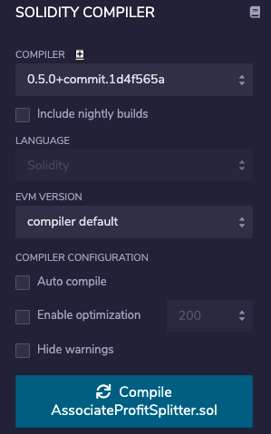
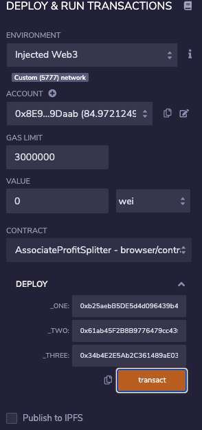
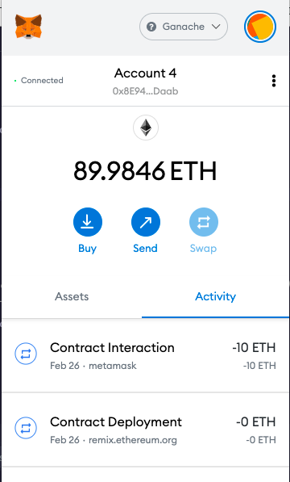
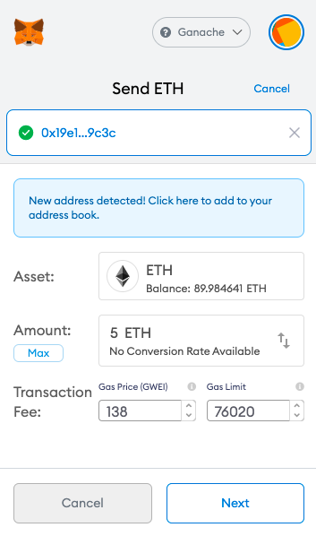
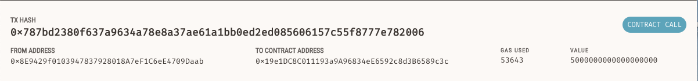
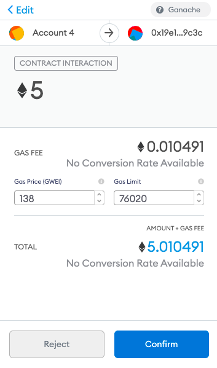
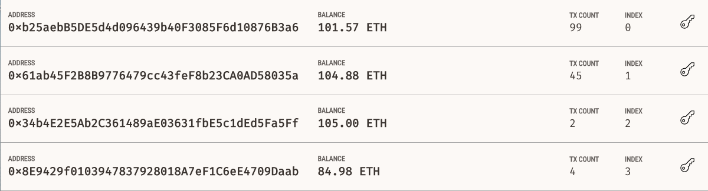
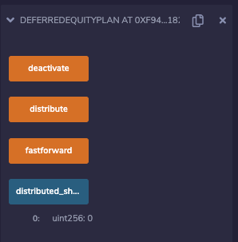

# Solidity: Smart Contracts

The two sample smart contracts that I completed were the Associate Profit Splitter and Deferred Equity Splitter contracts. Each of these contracts has a purpose for automating the delivering of funds to designated recipients.

The Associate Profit Splitter is designed to deposit funds in each of the specified accounts when ether is sent to the smart contract. The Deferred Equity Splitter sends shares to the specified individuals over time. 

Interacting with the Associate Profit Splitter happens as follows. Compile and Deploy the solidity file on remix. www.remix.ethereum.org 

Afterwards, deploy the contract by enterring three test addresses where you wish to send funds like so and then click transact 

After that, all interaction takes place through metamask. In order to send funds to the contract, navigate to the Metamask icon and select a test account that is not one of the main accounts about to be paid. 

Next, click on the send icon and enter the contract's address. 

You can find the contract's address in your Ganache's transaction tab. This contract is located at 

The click next and confirm in Metamask. 

Now, head on over to your Ganache's account page and see the funds that you've just moved! 

Follow the same steps to compile and deploy the Deferred Equity Splitter smart contract on Remix and interact with the smart contract on Remix's UI. 